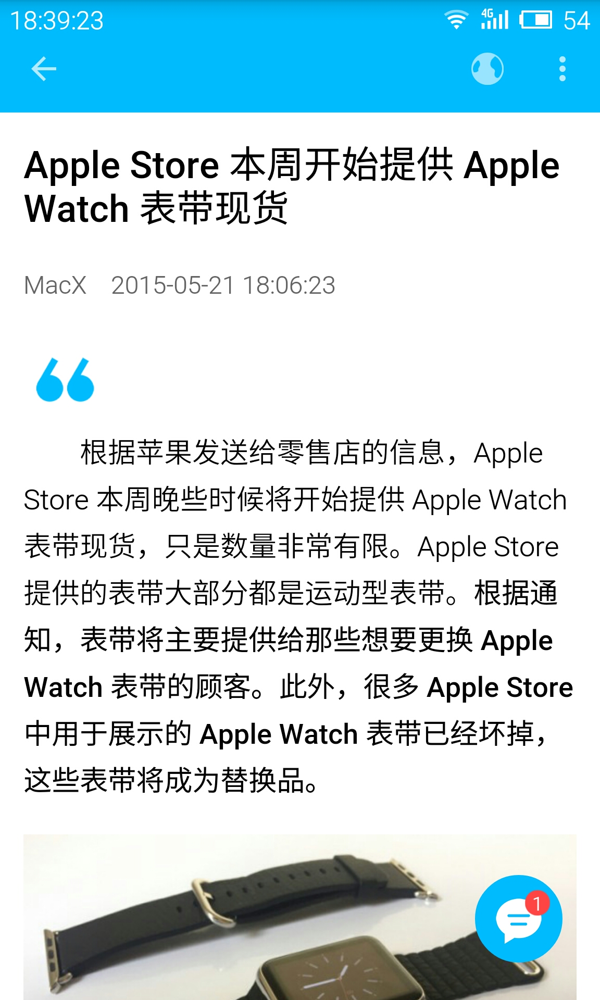
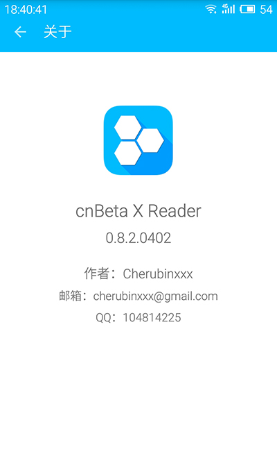

# cnBeta X Reader
A reader for cnbeta.com.  

> Author : Cherubinxxx  
Email : cherubinxxx@gmail.com  
QQ : 104814225  

## Version
0.8.2.0402 - 
[百度云](http://pan.baidu.com/s/1gdw81KB)、
[Github](https://github.com/cherubinxxx/cnBeta-X-Reader/raw/master/cnBetaXReader.0.8.2.0402.apk)  
  
## Preview
  

  

  

## Pre Requisites
support-v4:22.0.0  
appcompat-v7:22.0.0  
recyclerview-v7:22.0.0  
[android-observablescrollview:1.5.0](https://github.com/ksoichiro/Android-ObservableScrollView)  
[floatingactionbutton:1.2.0](https://github.com/makovkastar/FloatingActionButton)  
[glide:3.5.2](https://github.com/bumptech/glide)  
[volley:1.0.15](https://github.com/mcxiaoke/android-volley)  

## Thanks
Junyue  
NashLegend - [Activity滑动返回操作，像iOS的UINavigationController、知乎的Android版那样](http://nashlegend.blog.51cto.com/5635342/1568629)   
...(Let me think)  

## Thinking...